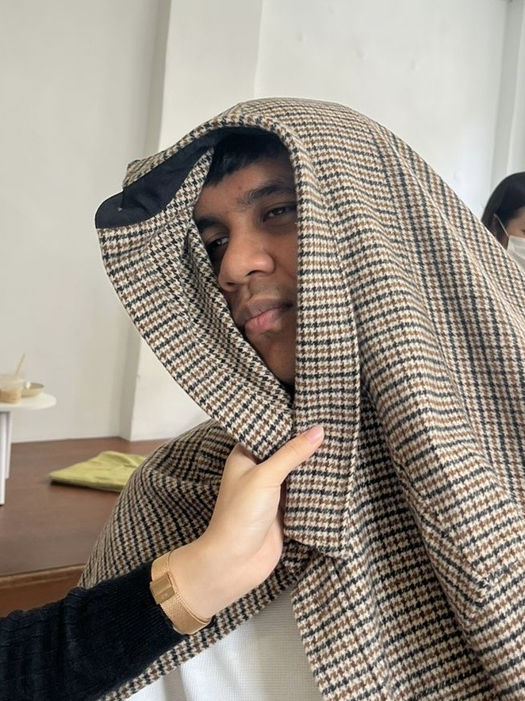

# Hola, saya Lutfil Hadi

I'm a final year Software Engineering student from the Faculty of Computer Science and Information Technology, University of Malaya. I am taking WIF3005 Software Maintenance Evolution for this semester.

- **Fun Fact**: I used to have a fear of zippers
- **Course expectations**: I expect to gain a solid understanding of software maintenance fundamentals, learn how to effectively use tools and techniques for various maintenance tasks, and explore strategies for evolving legacy systems and frameworks while building hands-on experience with API programming, component-based development, and debugging.

## GitHub Profile

Check out my GitHub profile [here](https://github.com/lhadi18)
